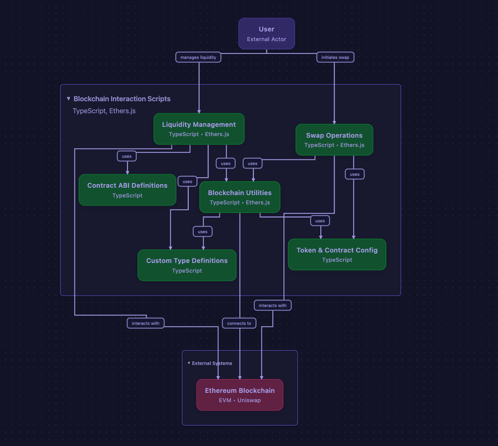
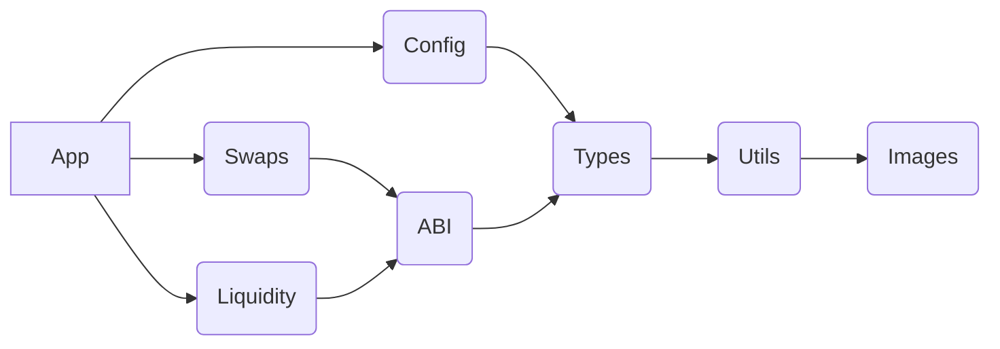
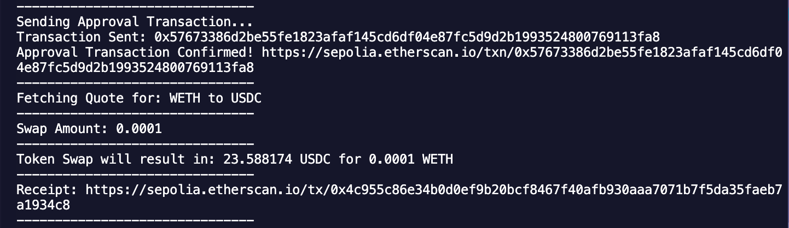

# Echos of Uni

## Project Description

This project allows users to swap tokens, add liquidity to pools, and manage their decentralized finance (DeFi) assets programmatically on UniswapV3. The application leverages the Uniswap V3 architecture and provides a user-friendly interface for interacting with the Ethereum blockchain.

## Architectural Overview



The project follows a modular architecture, with distinct components for swapping tokens, managing liquidity, and handling user interactions. The key components include:

- **`app/swaps/`**: This directory contains the core logic for swapping tokens. It includes modules for:
  - **Quote Generation:** Determining the optimal exchange rate for a given token pair.
  - **Transaction Preparation:** Constructing the necessary transaction parameters for interacting with the Uniswap V3 smart contracts.
  - **Execution:** Submitting the transaction to the Ethereum blockchain.
- **`app/liquidity/`**: Includes modules for adding and removing liquidity from pools, as well as managing pool parameters.
- **`config/`**: Stores configuration files, such as token lists and network settings.
- **`abi/`**: Contains ABI files for interacting with Ethereum smart contracts, including ERC20 tokens, Uniswap V3 Factory, Pool, Quoter, and Router contracts.
- **`types/`**: Defines TypeScript types for data structures used throughout the application.
- **`utils/`**: Provides utility functions for common tasks, such as handling blockchain interactions and data formatting.
- **`images/`**: Contains images used in the application, such as logos and screenshots.



## Setup Instructions

To install dependencies:

```bash
bun install
```

## Usage Examples

### Swapping Tokens

1.  Navigate to the "Swap" page.
2.  Select the input and output tokens.
3.  Enter the amount of input tokens to swap.
4.  Review the quote and confirm the transaction.

### Adding Liquidity

1.  Navigate to the "Add Liquidity" page.
2.  Select the tokens for the liquidity pool.
3.  Enter the desired amounts of each token.
4.  Approve the transaction and confirm.

### Image



This image shows the main page of the Echos of Uni application, displaying the swap interface.

The swapping feature allows users to exchange one token for another. It works by interacting with Uniswap V3 pools, which are smart contracts that hold reserves of different tokens. When a user initiates a swap, the application calculates the optimal exchange rate and routes the transaction through the appropriate pool.

## Contributing Guidelines

Contributions are welcome! Please follow these guidelines:

1.  Fork the repository.
2.  Create a new branch for your feature or bug fix.
3.  Write tests for your code.
4.  Submit a pull request.

## License

[MIT License](LICENSE)
